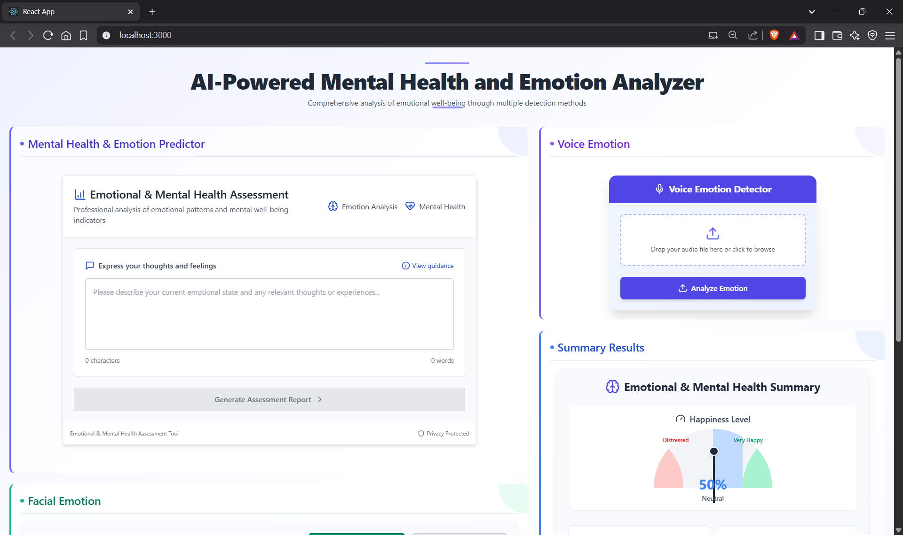
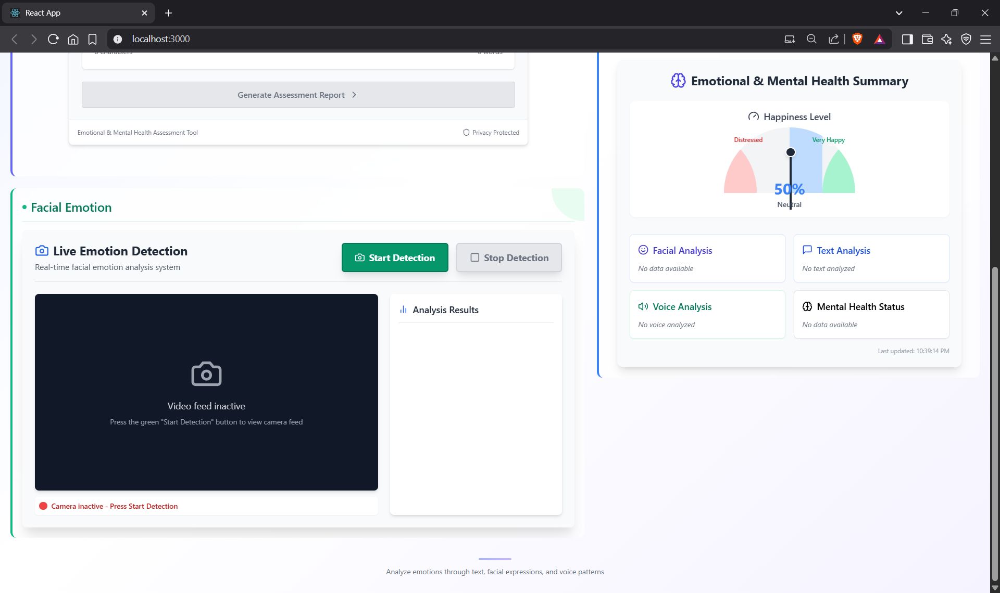
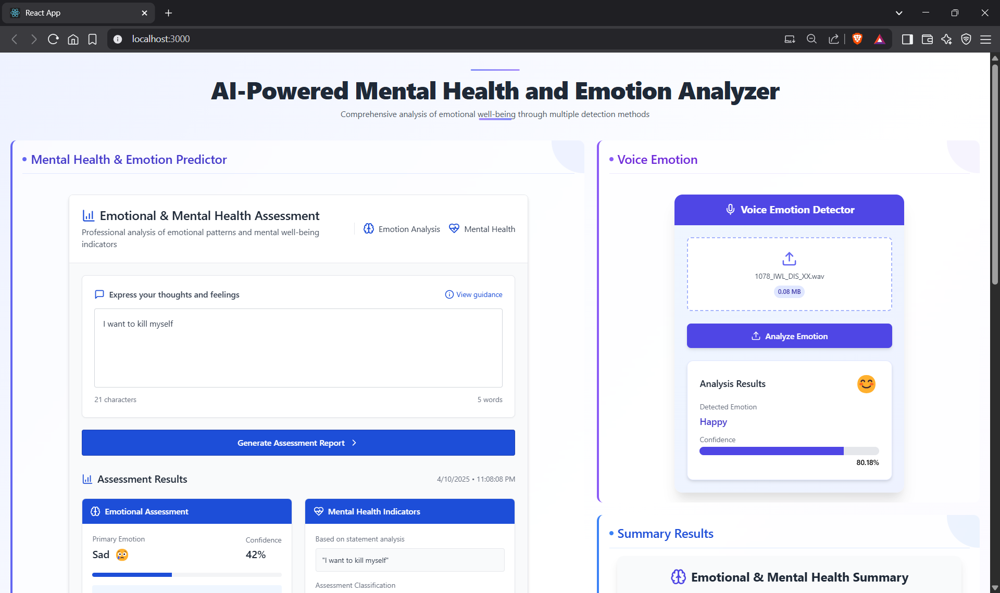
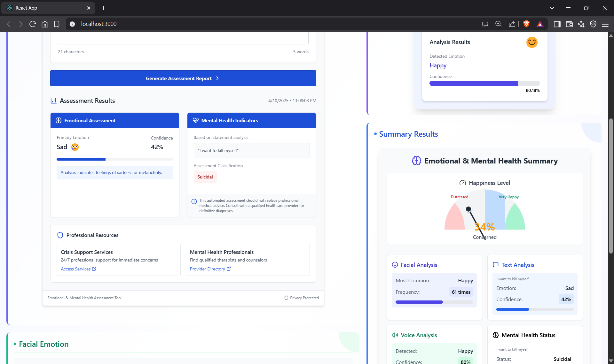
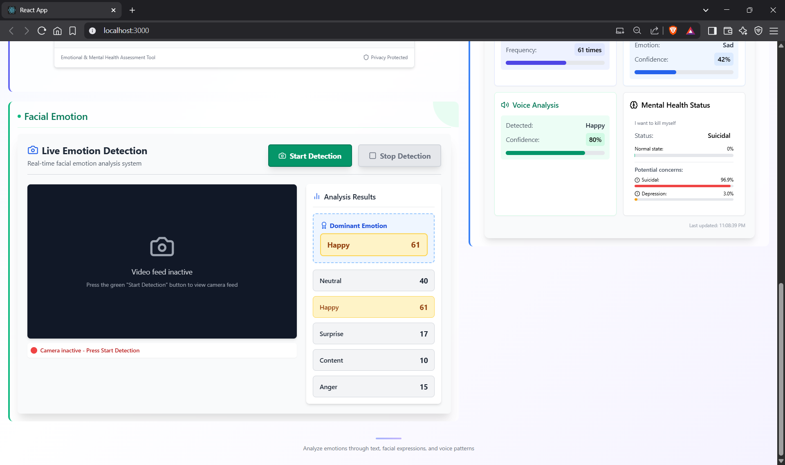

# 🧠 MultiModalMentalHealth

<div align="center">




<h3>An AI-Powered Mental Health Assessment System</h3>
<p>Comprehensive emotional well-being analysis through <b>text</b>, <b>audio</b>, and <b>video</b> detection</p>

<!-- Multiple images displayed in a neat row -->




</div>

---

## 🎯 Key Features

### 🔤 Text Emotion Analysis
- 💬 Understand users' emotions through their words using advanced BERT-based NLP models
- 📈 Perform real-time sentiment analysis from written messages, journal entries, or social posts
- 🧠 Detect potential mental health concerns with professional-grade precision

### 🎵 Audio Emotion Recognition
- 🎙️ Analyze tone, pitch, and voice patterns using Librosa & TensorFlow
- ⚡ Get instant feedback with real-time speech emotion detection
- 🎧 Smart preprocessing and feature extraction ensure robust performance

### 📹 Video Facial Expression Detection
- 👀 Capture facial cues using YOLOv8-powered computer vision
- 🕵️‍♀️ Detect micro-expressions and multi-emotion blends with confidence scoring
- 🎥 Supports live webcam analysis for dynamic emotional tracking

### 📊 Happiness Meter Visualization
- 🧭 Speedometer-style indicators offer a quick snapshot of emotional well-being
- 🟢 🟡 🔴 Color-coded emotional states:
  - **Green** = Happy
  - **Yellow** = Neutral
  - **Red** = Distressed
- 📊 A unified multimodal dashboard brings together all insights in a human-centered way

---

## 🖼️ Application Interface

A single-page application that brings together all emotional analysis tools in one seamless experience.

<p align="center">
  
</p>

<p align="center">
  
</p>

---

## 📈 Real-Time Analysis Results

### 📝 Text Analysis with Happiness Meter
- 📊 Shows emotion breakdown from text with visual feedback
- 🧠 Includes mental health indicators for better well-being tracking

<p align="center">
  
</p>

### 🎤 Audio Analysis with Speedometer
- 🔊 Detects voice emotion with confidence levels
- 🎯 Displays results using a speedometer-style happiness gauge

<p align="center">
  
</p>

### 🎬 Video Analysis with Live Detection
- 📹 Real-time facial expression analysis
- 📈 Tracks emotion frequency for comprehensive behavioral insight

<p align="center">
  
</p>

---

## 🏗️ Project Structure

```
MultiModalMentalHealth/
├── 🎨 MiniProject_Frontend/
│   └── emotion-detector-app/              # React Single Page Application
│       ├── 📁 src/
│       │   ├── 📊 FinalSummary/           # Results summary components
│       │   │   └── FinalSummary.jsx       # Overall analysis dashboard
│       │   ├── 🌐 GlobalAPIResults/       # API response handlers
│       │   │   └── GlobalAPIResults.jsx
│       │   ├── 🏥 MentalHealth/           # Mental health analysis
│       │   │   └── MentalHealthPredictor.jsx
│       │   ├── 🔧 Services/               # API service layer
│       │   │   ├── EmotionTextAPI.jsx     # Text analysis API
│       │   │   ├── EmotionVideoAPI.jsx    # Video analysis API
│       │   │   ├── EmotionVoiceAPI.jsx    # Audio analysis API
│       │   │   └── MentalHealthAPI.jsx    # Mental health API
│       │   ├── 📝 TextEmotionDetector/
│       │   │   └── TextEmotionDetector.jsx
│       │   ├── 🎬 VideoEmotionPredictor/
│       │   │   └── VideoEmotionPredictor.jsx
│       │   ├── 🎤 VoiceEmotionPredictor/
│       │   │   └── VoiceEmotionPredictor.jsx
│       │   ├── 🎨 App.css                 # Main styling
│       │   ├── ⚛️ App.js                  # Main application component
│       │   ├── 🧪 App.test.js             # Test configuration
│       │   ├── 📄 index.css               # Global styles
│       │   ├── 🚀 index.js                # Application entry point
│       │   ├── 🏷️ logo.svg                # Application logo
│       │   ├── 📊 reportWebVitals.js      # Performance monitoring
│       │   └── 🛠️ setupTests.js           # Testing setup
│       ├── 📁 public/                     # Static assets
│       ├── 📦 package.json                # Dependencies
│       ├── ⚙️ tailwind.config.js          # TailwindCSS config
│       └── 🔐 .env                        # Environment variables
├── 🚀 Mini_Project_API/                   # FastAPI Backend
│   ├── 🤖 TextEmotionModel/               # BERT-based text models
│   ├── 📝 Textemotion/                    # Text processing utilities  
│   ├── 🎬 VideoEmotionModel/              # YOLOv8 video models
│   ├── 🧠 textmentalhealth_92/            # Mental health assessment
│   ├── 🔊 voicemodel/                     # Audio emotion models
│   ├── 🎯 client.py                       # Development server launcher
│   ├── 📊 emotion_text_prediction.py      # Text emotion endpoints
│   ├── 🎵 emotion_voice.py                # Audio emotion endpoints
│   ├── 🏥 mental_health_predictor.py      # Mental health endpoints
│   ├── 🎥 yolo_utils.py                   # Video processing utilities
│   ├── 🚪 main.py                         # FastAPI application
│   └── 📋 requirements.txt                # Python dependencies
├── 📄 README.md                           # Project documentation
└── 🔧 Configuration files                 # Git and project configs
```

---

## 🚀 Easy Installation Guide

### 📋 Prerequisites

Make sure you have the following installed before getting started:

- 🐍 **Python 3.8+**
- ⚡ **Node.js 16+** and **npm**
- 📦 **Git** with **Git LFS** support
- 🎥🎤 **A webcam and microphone** (for live emotion analysis)

### 🔥 Quick Start — Get Running in Under 5 Minutes!

#### Step 1: Clone the Repository

```bash
git clone https://github.com/yourusername/MultiModalMentalHealth.git
cd MultiModalMentalHealth
```

#### Step 2: Backend Setup (FastAPI)

```bash
# Navigate to backend directory
cd Mini_Project_API

# Create virtual environment
python -m venv venv

# Activate virtual environment
# For Windows:
venv\Scripts\activate

# For macOS/Linux:
source venv/bin/activate

# Install all dependencies
pip install -r requirements.txt

# Start the FastAPI server
python client.py
```

**✅ Backend Ready!**  
Server will be live at: `http://localhost:8080`

#### Step 3: Frontend Setup (React)

```bash
# Open a new terminal and navigate to the frontend directory
cd MiniProject_Frontend/emotion-detector-app

# Install dependencies
npm install

# Create environment config
echo "REACT_APP_BASE_URL=http://localhost:8080" > .env

# Start the React application
npm start
```

**✅ Frontend Ready!**  
Your app will open at: `http://localhost:3000`

### 🎯 That's It! You're All Set!

1. Open your browser and visit `http://localhost:3000`
2. Start exploring emotions across text, audio, and video — all in real-time!

---

## 🎯 How to Use the Application

### 🖥️ Single-Page Interface
The application features a sleek, single-page design where all analysis tools — text, voice, and video — are integrated into one smooth user experience.

### 📝 Text Emotion Analysis
1. **✍️ Input:** Type your thoughts, feelings, or any content in the text area
2. **🔘 Click:** Hit the "Generate Assessment Report" button
3. **⚡ View:** Instantly see emotion predictions and happiness meter
4. **📊 Results:**
   - Primary emotion (e.g., joy, anger, sadness)
   - Confidence level
   - Mental health indicators

### 🎤 Voice Emotion Recognition
1. **🎧 Upload:** Click "Voice Emotion Detector" and upload an audio file (.wav format)
2. **🧠 Analyze:** Press "Analyze Emotion" to start processing
3. **📈 Results:**
   - Emotional breakdown with confidence scores
   - Visual speedometer showing happiness level

### 🎬 Video-Based Emotion Detection
1. **🎥 Start:** Click "Start Detection" to turn on your camera
2. **📷 Live Feed:** Position yourself in front of the webcam
3. **🔍 Real-Time Analysis:**
   - Watch emotions detected live
   - See frequency counters for each emotion
   - Get a full visual report of facial expressions

### 📊 Understanding the Happiness Meter

The speedometer-style visualization helps interpret emotional well-being at a glance:

| Zone | Range | Description |
|------|-------|-------------|
| 🟢 **Green** | 70–100% | High happiness, positive state |
| 🟡 **Yellow** | 40–69% | Neutral state, balanced mood |
| 🔴 **Red** | 0–39% | Low happiness, may need care |

### 🔄 Multimodal Emotion Analysis
- **🧩 Combine Inputs:** Use text, voice, and video together for deeper insights
- **📊 Real-Time Dashboard:** View all emotions side-by-side in one unified panel
- **📁 Export Reports:** Generate detailed emotional health summaries — great for tracking or professional assessments

---

## 🛠️ Technology Stack

Explore the powerful technologies that bring MultiModalMentalHealth to life — from modern frontend frameworks to cutting-edge AI libraries.

### 🎨 Frontend Technologies
A clean and responsive single-page application (SPA) built for performance and usability:

- **⚛️ React 18** — A fast, flexible JavaScript library for building dynamic UIs
- **🎨 TailwindCSS** — Utility-first CSS framework for fully responsive and elegant designs
- **✨ JavaScript (ES6+)** — Modern JS with features like async/await, arrow functions, and destructuring
- **🧩 Component Architecture** — Modular, reusable React components for each feature (Text, Audio, Video analysis)

### 🚀 Backend Technologies
A high-performance backend that handles real-time requests and processes media data efficiently:

- **⚡ FastAPI** — Blazing-fast Python web framework with automatic Swagger docs
- **🚀 Uvicorn** — ASGI server that powers the backend with ultra-low latency
- **🌐 CORS Middleware** — Enables seamless communication between frontend and backend
- **📁 File Upload Handling** — Supports audio/video uploads with multipart form data

### 🤖 AI & Machine Learning Technologies
The core intelligence of the app is powered by state-of-the-art AI libraries:

- **🧠 HuggingFace Transformers** — Pre-trained BERT models for emotion analysis from text
- **🎵 TensorFlow** — Processes and classifies audio signals for emotion recognition
- **🔥 PyTorch** — Powers neural network inference and model evaluation
- **🎧 Librosa** — Extracts audio features like MFCCs, pitch, and zero-crossing rate
- **👁️ OpenCV** — Handles video capture and image preprocessing
- **🧿 YOLOv8 (Ultralytics)** — Detects real-time facial expressions with high accuracy
- **🧪 Scikit-learn** — Offers utilities for preprocessing, evaluation, and model tuning

---

## 🔧 Configuration & Environment Setup

This section helps you get your environment variables, dependencies, and configurations set up correctly — for both the frontend and backend.

### 🌐 Frontend Environment Variables

Create a `.env` file inside `MiniProject_Frontend/emotion-detector-app/`:

```env
# Backend API Base URL
REACT_APP_BASE_URL=http://localhost:8080

# For development with tunneling (optional)
# REACT_APP_BASE_URL=https://your-tunnel-url.com

# Enable development mode (optional)
REACT_APP_ENV=development
```

### ⚙️ Backend Configuration

The `client.py` script in `Mini_Project_API` automatically sets up your FastAPI server.

```python
# Automatic IP detection and server startup
HOST = "0.0.0.0"     # Accept connections from any IP
PORT = 8080          # Default port

# CORS settings (pre-configured for development)
CORS_ORIGINS = ["*"]  # Allow all origins
```

### 📦 Dependencies Management

#### ✅ Python Backend Dependencies (requirements.txt)

Make sure these packages are installed in your backend virtual environment:

```txt
torch>=1.9.0
transformers>=4.20.0
safetensors>=0.3.0
tensorflow>=2.8.0
librosa>=0.9.0
soundfile>=0.10.0
scikit-learn>=1.1.0
fastapi>=0.85.0
uvicorn[standard]>=0.18.0
aiofiles>=0.8.0
python-multipart>=0.0.5
ultralytics>=8.0.0
opencv-python>=4.6.0
pydantic>=1.9.0
```

Install all dependencies:

```bash
pip install -r requirements.txt
```

#### ✅ React Frontend Dependencies

Make sure your frontend includes:
- React 18+ (with Hooks)
- TailwindCSS
- Axios (for API calls, if used)
- File upload utilities (e.g., input handlers)

Install dependencies with:

```bash
npm install
```

---

## 🐛 Troubleshooting Guide

### 🔴 Backend Won't Start

```bash
# Check if port 8080 is in use
netstat -ano | findstr :8080

# Kill the process if needed (Windows)
taskkill /PID <PID_NUMBER> /F
```

Or, change the port in `client.py`:

```python
PORT = 8081  # Use a different available port
```

### 🔴 "Module Not Found" Errors

```bash
# Make sure your virtual environment is activated

# Windows:
venv\Scripts\activate

# macOS/Linux:
source venv/bin/activate

# Reinstall dependencies
pip install -r requirements.txt
```

### 🔴 Frontend Can't Connect to Backend

```bash
# Check .env file path & value
cat MiniProject_Frontend/emotion-detector-app/.env

# Ensure backend server is running
curl http://localhost:8080
```

**✅ Common Fixes:**
- Make sure backend is running on correct port
- Confirm `REACT_APP_BASE_URL` matches backend URL
- Temporarily disable firewalls blocking localhost

### 🔴 Camera / Microphone Access Denied

**Chrome/Edge:** Click the 🔒 or 🎥 icon in the address bar → Allow access

**Firefox:** Click the 🛡️ shield → Manage permissions → Allow camera/mic

**System Settings:**
- **Windows:** Go to Privacy Settings → Camera & Microphone → Allow apps
- **macOS:** System Preferences → Security & Privacy → Enable access

**NOTE:** For production builds, camera/mic access requires HTTPS

---

## 🐞 Additional Troubleshooting & Tips

Get your environment back on track with these advanced fixes for common issues related to model files, builds, and performance.

### 🔴 Large Model Files Missing

If some model folders are empty or not working correctly, it's likely due to missing Git Large File Storage (LFS) files.

```bash
# Step 1: Install Git LFS if you haven't already
git lfs install

# Step 2: Pull large model files
git lfs pull
```

**✅ Verify the model directories contain files:**

```bash
ls Mini_Project_API/TextEmotionModel/
ls Mini_Project_API/VideoEmotionModel/
ls Mini_Project_API/voicemodel/
```

If folders are empty, the model weights haven't been downloaded properly. Re-run the above commands or check your GitHub permissions for LFS.

### 🔴 React App Build or Start Issues

If the frontend refuses to start or throws strange errors:

```bash
# Step 1: Clear NPM cache
npm cache clean --force

# Step 2: Delete node_modules and lock file
rm -rf node_modules package-lock.json

# Step 3: Reinstall dependencies
npm install

# Step 4: Verify Node.js and npm versions
node --version   # Should be 16.x or higher
npm --version
```

**⚠️ Using incompatible versions of Node can break your build. Recommended: Node 16.x and npm 8+.**

---

## 🛠️ Advanced Troubleshooting

### 🚀 Performance Issues

**Video Detection is Lagging?**
- Lower the camera resolution in your browser or use an external webcam with higher FPS.

**Model Takes Time to Respond?**
- Initial model loading may take 30–60 seconds after the first request.

**System Slow or Laggy?**
- Free up system memory by closing unnecessary apps, especially when running all 3 modalities (Text, Audio, Video) together.

### 💡 Developer Tips

**🔁 Hot Reload Enabled**
- Frontend (`npm start`) and backend (`uvicorn`) both support hot reloading on file changes.

**🧪 Test API with Swagger UI**
- Open `http://localhost:8080/docs` to interact with all backend routes visually.

**🐞 Enable Debug Mode**
- Set `REACT_APP_ENV=development` in the `.env` file for more detailed frontend error logs.

### 📞 Still Need Help?

If you're still stuck or facing edge-case errors:

- **🧪 Check Browser Console:** Press F12 → Console tab to inspect frontend issues
- **🖥️ Check Terminal Logs:** Look at FastAPI logs for backend exceptions
- **🐛 Create a GitHub Issue:**
  - Include a short description, terminal logs, error screenshots, and your system details

**💻 System Requirements:**
- Python 3.8+
- Node.js 16+
- Webcam

---

<div align="center">

**Made with ❤️ for mental health awareness and AI innovation**

*Remember: Technology can support mental health, but human connection and professional care remain irreplaceable.*

</div>
